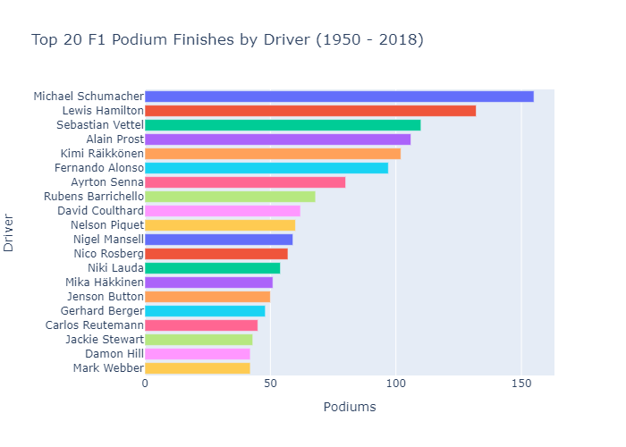
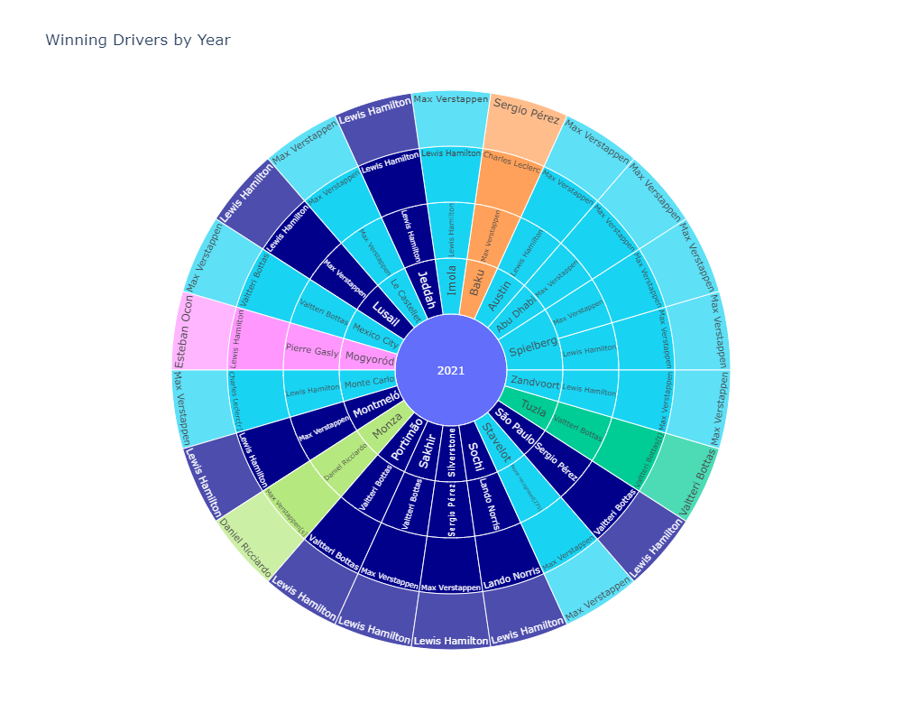

# Introduction Team 4 – Formula 1 Analysis
Formula 1 represents the pinnacle of modern of modern automotive engineering. Our group decided to research data on this famous race and analyse race outcomes. Data has been extracted from various online motor sports sites and converted to CSV files to obtain clean data. API’s from sites such as ergast.com and Postman Formula 1 were used to also source data.
We chose to analyse areas such as technological changes, pit stop times/starting positions, country of origin for drivers, race results and budgets.

Over the course of 72 years of Formula 1 racing, it has grown to a global sport and we have seen many changes in technology, safety and strategy to enhance the competition and spectacle of the sport

# Images Used
* 

* In almost 70 year history of the race between 1950 and 2018, UK and Germany are the two countries that have chalked up the most nunber of wins - over 70% of the total races.

* UK's total number of wins nearly doubled that of Germany in during the period.

## Some Querky Formula 1 facts:
Formula 1 racing commenced in 1950 with the first race at Silverstone, England. England is the only county to have a Formula 1 race every year since inception. The Ferrari team is distinguished by its red colour, however John Surtees clinched the 1964 Championship in a Ferrari painted blue due to a disagreement that Enzo Ferrari had with the Italian Automobile Club.
Jochen Rindt is the only driver in history to win a world championship posthumously after a fatal accident in practice at the Italian Grand Prix in 1970. He maintained his lead in the championship for the remaining 3 races to clinch the title.
The most pit stops by a Grand Prix winner is 6 by Jenson Button at the Canadian Grand Prix 2011.
Interestingly the weekends 2022 Australian Grand Prix established a new crowd record crowd of 419,000 spectators over the 4 day event.

## Budget effects on Formula 1 racing

While looking at the budgets of formula 1 racing the question that came to me was, which teams spend the most on racing and what impact does this have on the results of the world championship. Traditionally Formula 1 racing is seen as the pinnacle of motor sport where spending for research and development was uncapped and constructor teams would employ an army of engineers, data analysts, mechanics, track team, factory team, logistics co-ordinators, commercial sponsorship personnel, communications and marketing/tv departments. In 2021 spending caps were introduced. Prior to spending caps, Mercedes would employ over 1200 staff to run their Formula 1 team. Essentially several teams had an unlimited budget, placing them at a great advantage over smaller teams. Rumblings within Formula 1 circles coming from the smaller teams and the onset of the global pandemic forced the governing body to put forward a spending cap on constructer teams to ensure viability of the championship. From 2021 a cap of $145 million USD was placed on constructor teams. In the past we had seen spending by major teams approaching the $500million mark with smaller teams contemplating leaving the championship.
The purpose of these caps is to provide long term financial sustainability for teams, and incentives for them to stay in the competition. At the same time this created a more level playing field, generating greater interest in the sport and potentially new followers, as closeness of the competition enhances the spectacle for Formula 1 Fans. Already in 2021 we have seen a challenge to the reigning champion, Lewis Hamilton and Mercedes, who won the championship between 2017 and 2020. They have been dethroned in the first year of expenditure caps in 2021.
Conclusion
We have seen the evolution of Formula 1 racing from 1950 when Giuseppe Farina donned his scull cap and googles, jumping into his racing car without seatbelt in his 350 brake horse power Alpha Romeo to current day, Lewis Hamilton suited up in his fire proof racing overalls and his 1000 Brake Horse Power Mercedes, which has been aerodynamically designed with a carbon fibre shell. In this time constructor teams have been looking for advantages through technology, strategy employing a team of engineers and data analysts running monte carlo systems and game theory outcomes on their computer models to gain any advantage possible to enhance the chances of their driver winning the Grand Prix and ultimately the Driver and Manufacturer championship. With budget spending capped and rules aligned for all competitors, the Formula Championship has never been more competitive for participants and interesting for racing fans.

* Consistent with the earlier bar chart, UK and Germany drivers seem represent 45% (9 out of 20) of the top 20 drivers that have the most number of championship wins since the inception of F1 race in 1950 up until 2018.

* During the period under review, Mercedes and Ferrari appear to be the two dominant teams to be reckoned with consistently winning over 80% of the races between them from 2018 - 2020.

* Ferrari's performance appears to have declined after 2018 and did not record any champrionship wins at all in 2020 and 2021 whilst the Red Bull team looks like they have been given a new lease of life in 2021 at the expense of Mercedes.

* Among all the teams, Mercedes have the most consistent driving pair chalking up the most pole positions, fastest laps and wins.
* Other teams appear to have switched drivers between seasons which could possibly explain the less consistent results achieved due to new drivers adapting to the team.

# Challenges Faced
* Pushing and merging data to the main branch in the GitHub repository.
* The data clensing process was tedious.
* Flattening deeply nested JSON files.
* Some charts did not display until bokeh was reinstalled.

## Sources:
Essentiallysports.com
Beyondtheflag.com
Autoweek.com
References:
Jacob Polychronis – Fox Sport -3/2/2022
Garry Anderson – The race.com – 1/2/2022
* [Wikipedia](https://en.wikipedia.org/wiki/List_of_Formula_One_circuits)
* Python package used: [Fast F1](https://github.com/theOehrly/Fast-F1)
* Import from csv downloaded from website